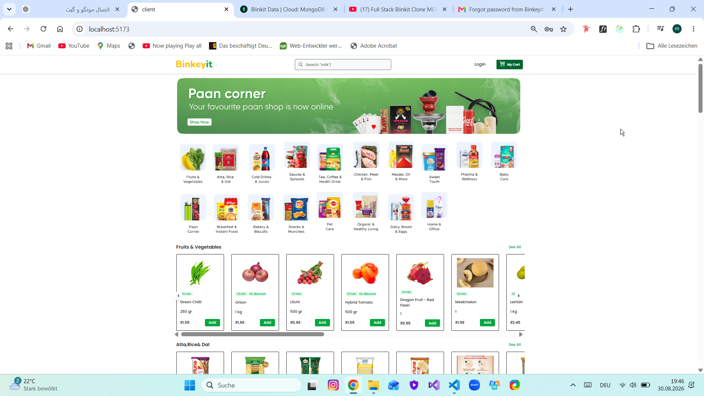
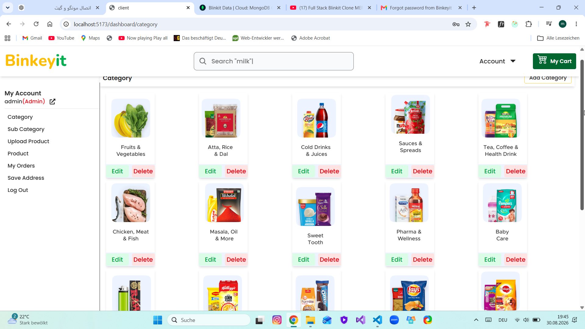
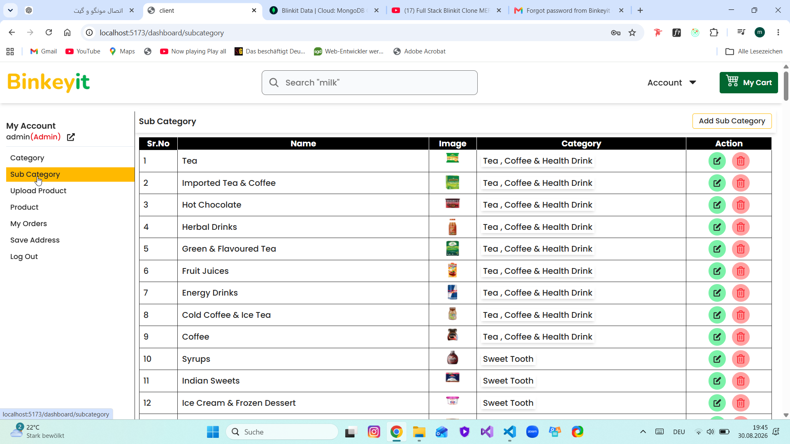
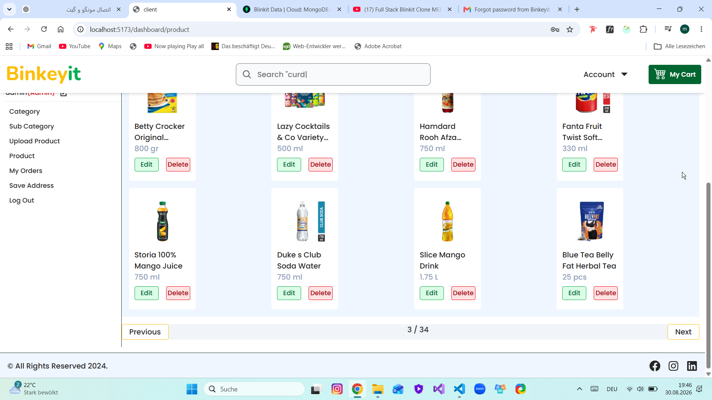
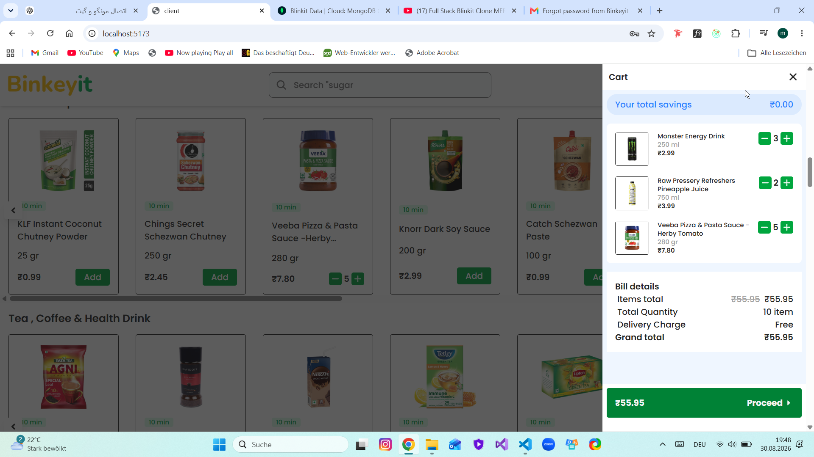
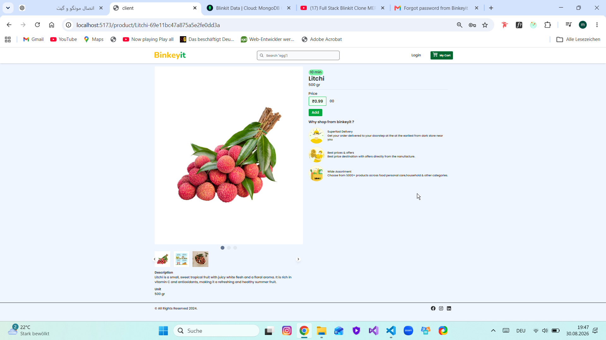
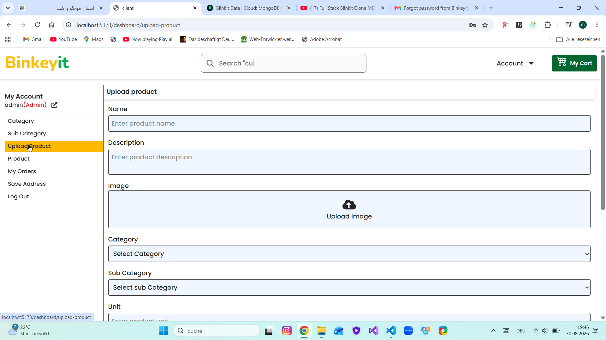

# 🛒 Full-Stack E-Commerce Website

A modern and responsive full-stack E-commerce application with a customer shopping platform and a complete admin dashboard for managing products, categories, subcategories, and orders.

## ✨ Features

### 👤 User

* Register & Login
* Forgot Password
* Email OTP Verification
* Access Token & Refresh Token
* Secure Cookie Authentication
* Browse Products
* Categories & Subcategories
* Product Details
* Add to Cart
* Increase / Decrease Quantity
* Remove from Cart
* Order Management
* Online Payment with Stripe
* Cash on Delivery
* Responsive Design

### 👨‍💼 Admin Panel

* Dashboard
* Category Management
* Subcategory Management
* Product Management
* Add Products
* Edit Products
* Delete Products
* Product Image Upload
* Cloudinary Image Management
* Assign Products to Categories & Subcategories
* Order Management

## 🛠️ Tech Stack

### Frontend

* React
* React Router DOM
* Redux
* Axios
* Tailwind CSS
* React Hook Form
* React Hot Toast
* React Icons
* React Infinite Scroll Component
* React Type Animation
* SweetAlert

### Backend

* Node.js
* Express.js
* MongoDB
* Mongoose
* JWT
* bcryptjs
* Cookie Parser
* CORS
* Helmet
* Morgan
* Multer
* Dotenv
* Nodemon
* Resend
* Stripe

### ☁️ Services

* MongoDB
* Cloudinary
* Stripe
* Resend

## 📸 Screenshots

### Home Page

![HomePage] 

### Categories & Subcategories

![Categories] 

### Subcategories

![Subcategories] 


### Product Management

![Products]

### Shopping Cart

![ShoppingCart] 

### Poduct details
![Productdetails]   

### Upload product
![Uploadproduct] 

## 🔐 Authentication

* JWT-based authentication
* Access & Refresh Token system
* HTTP Cookie authentication
* Password encryption with bcryptjs
* OTP-based email verification
* Forgot password functionality

## 💳 Payment

* Stripe Online Payment
* Cash on Delivery
* Order creation and management

## 🖼️ Image Management

* Product image upload with Multer
* Cloudinary integration for image storage and management

## 📱 Responsive

The application is fully responsive and optimized for:

* Desktop
* Tablet
* Mobile

## 🚀 Getting Started

### Clone the repository

```bash
git clone YOUR_REPOSITORY_URL
cd YOUR_PROJECT_NAME
```

### Install dependencies

Frontend:

```bash
cd frontend
npm install
```

Backend:

```bash
cd backend
npm install
```

### Environment Variables

Create a `.env` file in the backend and configure the required environment variables for:

* MongoDB
* JWT
* Resend
* Cloudinary
* Stripe

### Run the application

Backend:

```bash
npm run dev
```

Frontend:

```bash
npm run dev
```

## 👩‍💻 Author

**Mahdieh Hajjar**

Full-Stack / Frontend Developer
